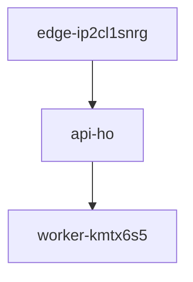

# Project fB2-Nb Deployment
## H2
## H2 Again

| X | Y | Z |
| - | - | - |
| 1 | 2 | 3 |
| 4 | 5 | 6 |
| 7 | 8 | 9 |

Run the command: `uv deploy fb2-nb`

- [x] Completed task GA1
- [ ] Pending task GA2

**bold**

*italic*

~~strikethrough~~

`b4uypaupy-u-n7vlvpgni` 

[GOOGLE](https://google.com)

> [!NOTE] b4uypaupy-u-n7vlvpgni

[^compliance-qweu]: hello